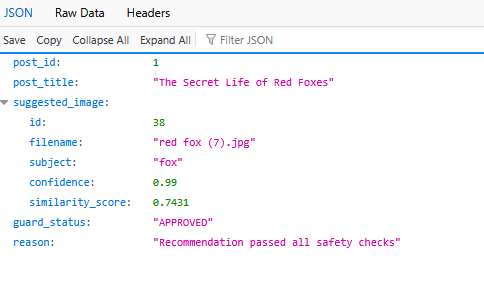

# Definition of Done Evidence

## AI PROCESSING

**[x] Vision model produces structured output validated against a schema; invalid responses are never trusted.**
```  {
    "subject": "Brown bear",
    "category": "animal",
    "attributes": [
      "brown fur",
      "shaggy coat",
      "walking",
      "outdoor enclosure",
      "claws visible",
      "head lowered"
    ],
    "caption": "A large brown bear with shaggy fur walks on rocky ground outdoors.",
    "confidence": 0.98,
    "filename": "bear (1).jpg",
    "embedding": [
        ****REDACTED****
    ]
  },*
```
**[x] Low-confidence classifications are flagged instead of accepted.**
```
if candidate_image.get("confidence", 0.0) < 0.85:
    return False, f"Vision confidence too low ({candidate_image.get('confidence')})"
```
**[x] Images are processed through a batch background job with retries.**
```
Number of images found: 50
processing image ../data/images\bear (1).jpg
processing image ../data/images\bear (10).jpg
processing image ../data/images\bear (2).jpg
processing image ../data/images\bear (3).jpg
processing image ../data/images\bear (4).jpg
processing image ../data/images\bear (5).jpg
...
```

**[x] Vision and embedding costs are tracked per call.**
```
{
  "run_timestamp": 1787432945.5155296,
  "total_images_processed": 50,
  "total_tokens_used": 63783,
  "total_cost_usd": 0.0,
  "breakdown": [
    {
      "filename": "bear (1).jpg",
      "tokens": 1273,
      "cost_usd": 0.0
    },
    {
      "filename": "bear (10).jpg",
      "tokens": 1278,
      "cost_usd": 0.0
    },
....]}
```


## MATCHING SYSTEM

**[x] Image and post embeddings are stored; posts return ranked image suggestions.**

`http://127.0.0.1:8000/posts/1/images`



**[x] Semantic matching works for equivalent concepts.**

`eval.py`
```
The Secret Life of Red Foxes -> Expected: 'fox', Got: 'fox'
Gray Wolf Pack Dynamics and Territorial Behavior -> Expected: 'wolves', Got: 'wolves'
Caring for Domestic Puppies and Dogs -> Expected: 'dog', Got: 'fox'
```

## SAFETY LAYER

**[x] The mismatch guard rejects incorrect recommendations - the wolf-on-a-fox-post scenario provably fails.**
```
Testing started at 12:41 PM ...
Launching pytest with arguments src/test_engine.py::test_mismatch_guard_rejects_wolf_for_fox --no-header --no-summary -q in D:\GitHub\flyrank-capstone-image-relevance

============================= test session starts =============================
collecting ... collected 1 item

src/test_engine.py::test_mismatch_guard_rejects_wolf_for_fox PASSED      [100%]

============================== 1 passed in 1.39s ==============================

Process finished with exit code 0
```


**[x] Rejections include a human-readable explanation.**

`matching_engine.py`

```
DEMO: Forcing a Wolf image on the Red Fox article...
Forced Candidate: wolve (1).jpg (Subject: 'wolves')
Mismatch Guard Status: REJECTED
Reason: Category mismatch: expected fox, detected wolf in candidate image
```

**[x] When no image clears the bar, the system answers "no confident match" with reasons.**

`matching_engine.py`


```
Article: "Deep Sea Marine Biology and Coral Reef Ecosystems"
Top Candidate: bear (5).jpg (Subject: 'Brown bears')
Similarity Score: 0.5259
Mismatch Guard Status: REJECTED
Reason: Similarity score 0.526 below threshold 0.60
```

## BACKEND

**[x] Database models for images, tags, embeddings, posts, suggestions, approvals/rejections with the required indexes.**

`database.py`

```
class ReviewRecord(Base):
    __tablename__ = "reviews"
    id = Column(Integer, primary_key=True, index=True)
    post_id = Column(Integer, ForeignKey("posts.id"))
    image_id = Column(Integer, ForeignKey("images.id"))
    is_approved = Column(Boolean)
    reason = Column(String)
```


**[x] API endpoints validated; the review workflow (approve/reject/inspect why) exists.**
```
Invoke-RestMethod -Uri http://127.0.0.1:8000/reviews -Method Post -Body '{"post_id": 1, "image_id": 38, "is_approved": true, "reason": "Looks good"}' -ContentType "application/json"

status  message                       
------  -------                       
success Review recorded in audit trail
```

## QUALITY & DOCUMENTATION

**[x] Automated tests cover schema validation, mismatch rejection, and matching accuracy.**

`test_engine.py`

```
src/test_engine.py::test_schema_validation_catches_errors PASSED         [ 33%]
src/test_engine.py::test_mismatch_guard_rejects_wolf_for_fox PASSED      [ 66%]
src/test_engine.py::test_mismatch_guard_approves_good_match PASSED       [100%]

============================== 3 passed in 1.39s ==============================
```

**[x] A small labeled evaluation dataset measures top-1 precision.**

`eval.py`

```
Final Top-1 Precision: 75.0%
```

**[x] README with architecture explanation.**
